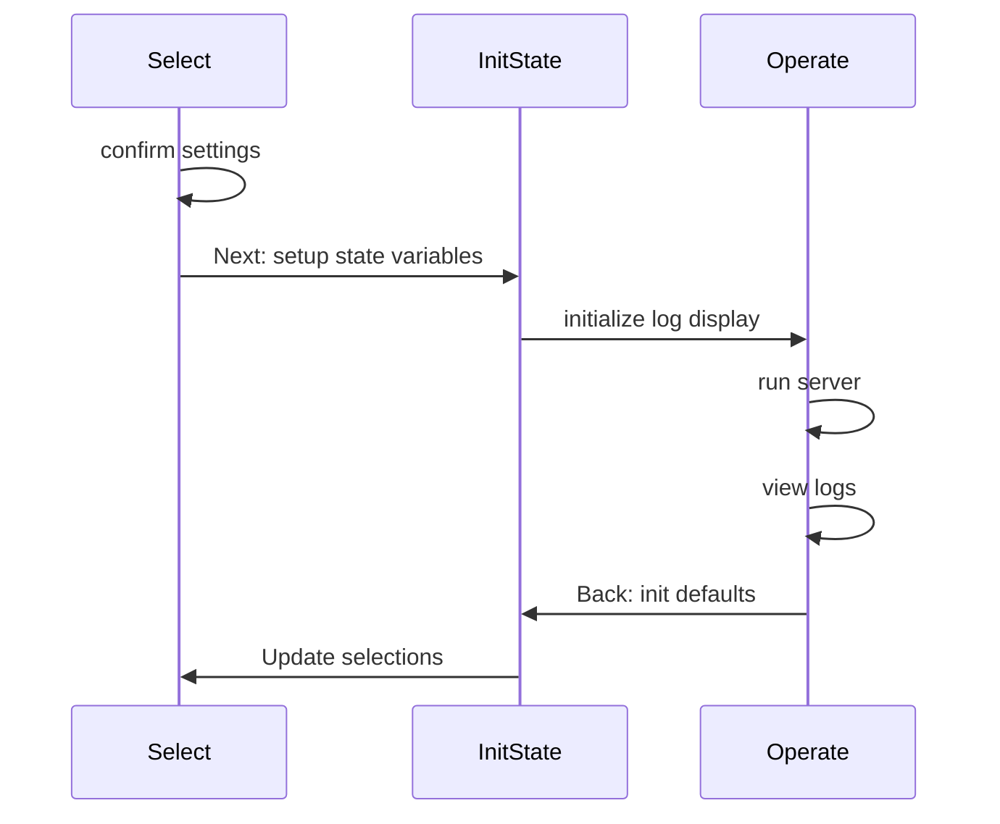

# 1.0 TUI Design Elements {#SDD_001}

The `daemontui` script provides a convenient way to run any of the
existing daemon scripts with default (but adjustable) values. The TUI
interface can support both keyboard and mouse input (as long as the
underlying console also supports mouse input) for both option selection
and navigation. The Debug option will increase verbosity both in the
daemon log output and the TUI parameters (on exit).

## Network functional elements

- server listens (IPv4 address and port, pyserv)
- server status checks daemon PID
- UI sets server params (defaults plus user overrides)

## UI elements

- edit and validate settings
- control server state
- view recent log output

### SW diagrams

Rendered versions of current mermaid_ diagrams are shown here, starting
with the following activity sequence diagram for the TUI context
loops.

  
tui_sequence_diagram source

  User activity sequence diagram showing 2 primary Screen contexts.

## 1.1 SDD_002 {#SDD_002}

### daemontui settings

The daemontui software must know the appropriate default settings, as
well as both allow changes at runtime, and match the pre-configured
values used by the daemon scripts.

Individual settings values are mostly specific to a server
implementation, eg, log file names and socket timeouts.

The software should provide appropriate data structures to handle both
groups of settings and dynamic data such as network device names and
file system paths, starting with user-confirmed runtime settings for
server and logging options.

*Parent links: TUI_002, TUI_003*

## 1.2 SDD_003 {#SDD_003}

### daemontui indicators

The daemontui software must display network and server status to the
operator using both visual indicators and log entries.

*Parent links: TUI_001, TUI_005*

## 1.3 SDD_004 {#SDD_004}

### daemontui controls

The daemontui software must provide obvious operator controls that
corespond to the primary daemon commands: [start, stop, status]

*Parent links: TUI_004*

