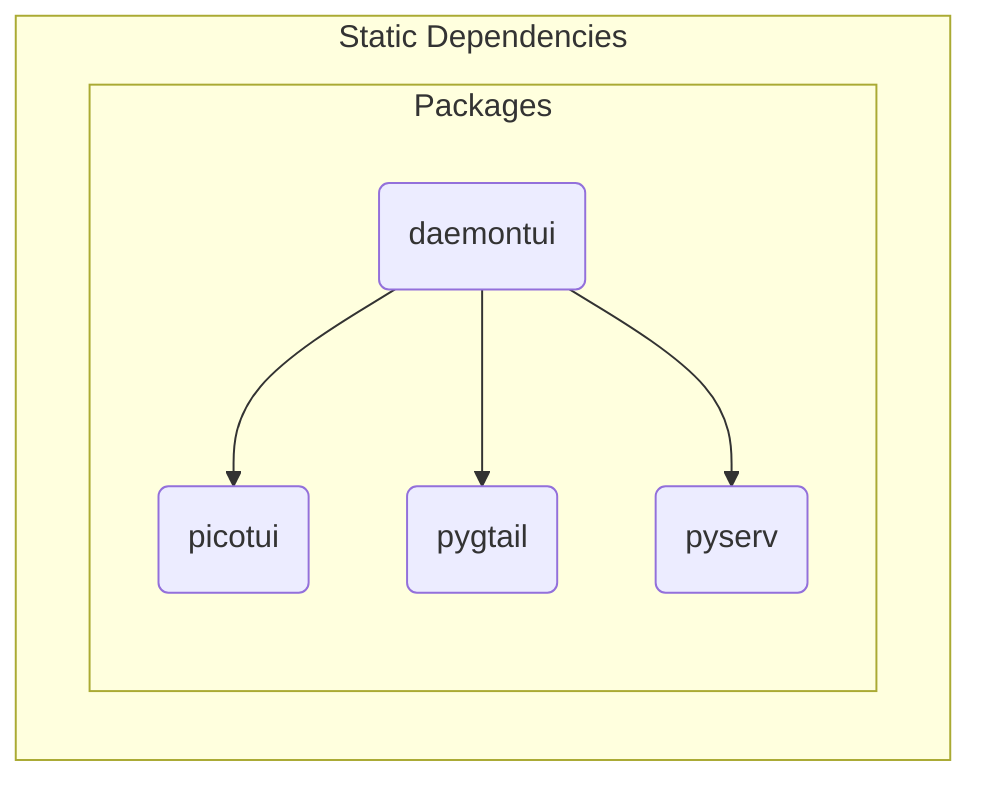

# TUI Design Elements

The `daemontui` script provides a convenient way to run any of the
existing daemon scripts with default (but adjustable) values. The TUI
interface can support both keyboard and mouse input (as long as the
underlying console also supports mouse input) for both option selection
and navigation. The Debug option will increase verbosity both in the
daemon log output and the TUI parameters (on exit).

## Network functional elements

- server listens (IPv4 address and port, pyserv)
- server status checks daemon PID
- UI sets server params (defaults plus user overrides)

## UI elements

- edit and validate settings
- control server state
- view recent log output

### SW diagrams

Rendered versions of current mermaid_ diagrams are shown here, starting
with the following activity sequence diagram for the TUI context
loops.

```{figure} assets/tui_sequence_diagram.svg
:width: 90 %
:align: center
:alt: activity sequence diagram

Activity Sequence Diagram.
```

<details>
  <summary>tui_sequence_diagram source</summary>
  User activity sequence diagram showing 2 primary Screen contexts.


</details>

#### SW dependencies

```{figure} assets/tui_dependency_graph.svg
:width: 65 %
:align: center
:alt: primary software dependencies

Primary Software Dependencies.
```


<details>
  <summary>tui_dependency_graph source</summary>
  daemontui dependency graph showing primary software units.


</details>